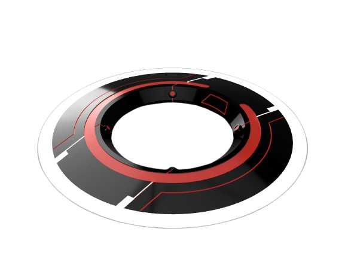
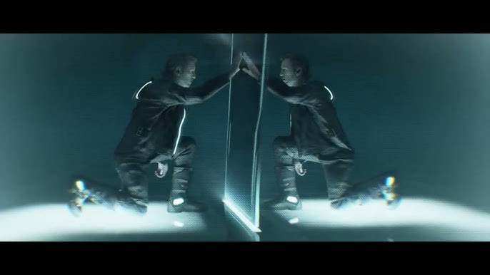
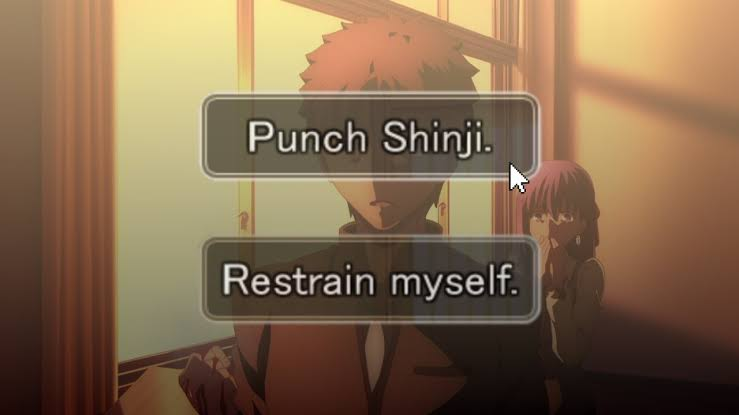
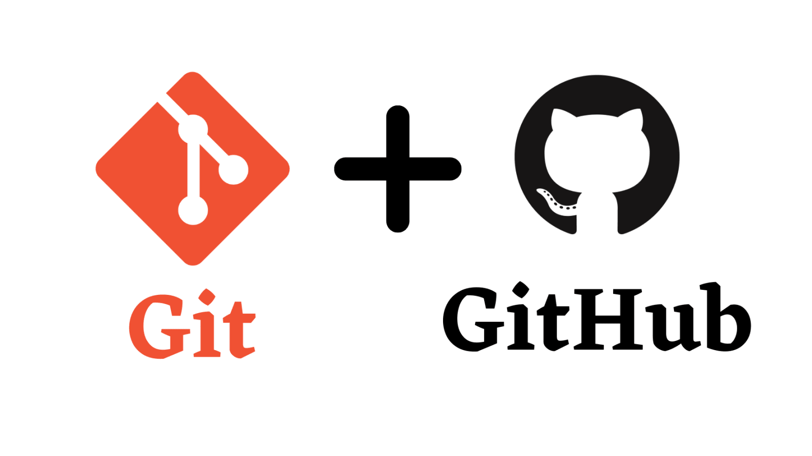
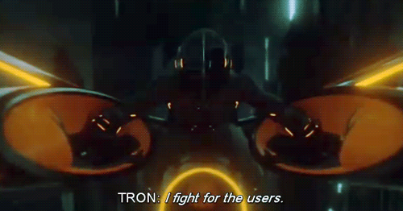

# FOP Tron

All the resources mentioned in this assignment can be found at [Here](https://github.com/funteck123/FOP_Tron/tree/main).

As of your Fundamental of Programming (FOP) Assignment, you are required to design and develop a 2D interactive game inspired by the Tron: Legacy (2010) and [Tron (1982 movie and video game)](https://en.wikipedia.org/wiki/Tron_(video_game)).


## 1 - Introduction


In this assignment, your task is to create a 2D interactive arena game that combines strategic gameplay with narrative storytelling. Players will control a futuristic Light Cycle that leaves behind a glowing energy trail (jetwall) as it moves through the Grid. The goal is simple — outmaneuver your opponents and make them collide with jetwalls, walls, or each other to be the last cycle standing.

However, this is not merely a game about survival. You are also tasked to implement a simple storyline, where narrative elements and cutscenes based on the Tron universe are progressively revealed through gameplay. Players will unlock new story chapters, achievements, and characters as they level up.


### 1.1 Overview

#### A. Objective

Design and develop a **Tron-inspired 2D grid game** in **Java**, demonstrating:

- Logic flow and program structure  
- Object-Oriented Programming (OOP)  
- File I/O handling  
- *(Optional)* Basic AI Bots and simple graphics (Swing or ASCII)

Your goal is to build a playable **Light Cycle Arena** game with leveling, enemies, and story progression.

---

#### B. Marks Distribution Summary

| Category | Marks | Description |
|-----------|:-----:|-------------|
| **Arena Design** | 0.5 | 40×40 grid arena with player movement and collisions. |
| **Playable Characters** | 1.0 | Two characters (`Tron`, `Kevin`) loaded via file I/O. |
| **Leveling System** | 1.5 | XP-based stat growth and unlocks up to Level 99. |
| **Enemy Design** | 1.5 | Four unique AI Bot enemies with attributes from file. |
| **Collision & Disc System** | 1.5 | Disc combat, wall collisions, and life system. |
| **Arena Gameplay Loop** | 1.0 | Real-time or turn-based arena gameplay with HUD. |
| **OOP & File Handling** | 1.0 | Proper use of abstraction, inheritance, and modular code. |

**Total Basic Marks: 8**

---

#### C. Extra Features (4 Marks)

| Feature | Marks | Description |
|----------|:-----:|-------------|
| Save Game & Leaderboard | 1.0 | Save/load progress and top player rankings. |
| Story & Cutscenes | 2.0 | Unlockable narrative between levels. |
| Random Arena Generator | 0.5 | Procedurally generated grids. |
| Aesthetic & Achievements | 0.5 | Colored text, ASCII art, and rewards. |

**Total Additional Marks: 4**

---

**Tip:**  
Focus on the core 8 marks first — movement, collision, File I/O, and basic gameplay.  
Add 1 or 2 extra features to get additional marks. It is NOT compulsory to implement only the same extra features.


## 2 - Basic Requirement (Total - 8 marks)

### 2.1 Arena Design (0.5 mark)


* Design a **40x40 grid-based arena** that represents the Light Cycle battlefield.
* Players must be able to move their cycles using the **W, A, S, and D keys**:
    * `W` moves upward
    * `S` moves downward
    * `A` moves left
    * `D` moves right
* Each cycle leaves behind a **jetwall** that acts as an impassable barrier.
* Hitting a jetwall or boundary wall causes the player to lose half a life (**-0.5 lives**) instead of instant derezzing.
* However, if the arena is an **open-type grid** (no boundaries), falling off results in the loss of all remaining lives.
* Provide **three predesigned arenas** and **one randomly generated arena** option.
* These arenas can differ in layout, speed ramp placement, and obstacle arrangement.


### 2.2 Creating characters (1 marks)


#### 2.2.1 Design Playable Characters

1. Create two character classes based on the information provided in characters.txt. This file contains the names of characters along with their initial attributes, including speed, handling, lives, discsOwned, and experiencePoints. When a player creates a new character, the character's initial attributes should be determined by the data in characters.txt.

2. `Characters` class should include a method called `levelUp()`.

3. Incorporate the principles of OOP. For instance, you can structure your code as follows in Java:

```java
class Tron extends Character {
    // Define instance variables here
}
```

Each playable character offers a distinct experience and storyline. 

| Character   | Color | Speed     | Handling    | Description                                    |
|---------|-------|-----------|------------|------------------------------------------------|
| Tron     | Blue  | Moderate | Balanced | The original defender of the Grid.   |
| Kevin | White   | Very High | Smooth      | The creator — stable and resilient.          |

Both characters share core properties such as speed, handling, lives, discsOwned, and experiencePoints. As they level up, their performance improves and new features such as light cycle variants, cutscenes, or storyline branches can be unlocked.

Character data should be loaded from a file (characters.txt) using File I/O.
No marks will be awarded if values are hardcoded without demonstrating file handling.


#### 2.2.2 Implement leveling-up system (1.5)

As characters progress through the Grid, they can gain experience (XP) and level up.
Here are the general rules for progression:

- During the first 10 levels, characters will require fewer experience points to level up, allowing for rapid early advancement.
- Defeating enemy Light Cycles awards XP based on their difficulty.
- Each level grants:
    - Improved speed or turn rate.
    - +1 life every 10 levels.
    - Additional disc slot every 15 levels.
    - Unlocks of new playable characters and story chapters.
- Maximum attainable level: 99.
- The rate of attribute increase upon leveling up will vary based on the character type:
  - `Tron`: Gains more speed and stability per level.
  - `Kevin Flynn`: Gains more handling precision and discsOwned per level.
- You are required to create a custom leveling-up algorithm for each character type.

You are encouraged to create cutscenes or visual sequences (static images or videos) that play when significant milestones are reached, such as unlocking Kevin Flynn or defeating Clu. These narrative unlocks are intended to deepen immersion, rewarding both gameplay skill and commitment.

### 2.3 Design Enemies (1.5 marks)

1. Design an Enemy superclass that represents AI-controlled opponents.
Each enemy should have attributes such as speed, handling, and aggressionLevel.
2. Design **4 unique enemies** that extend the `Enemy` class based on description in `enemies.txt`
3. Their positions on the arena are generated randomly each round.
4. Each time a new match begins, (seven) enemies (chosen from different types) are spawned.

```java

// Define the Enemy class to represent in-game AI opponents.
class Enemy {
    String name;         // Enemy identifier
    String color;        // Jetwall color
    double speed;        // Movement speed
    double handling;     // Turning efficiency
    double aggression;   // Determines chase and attack logic
}

```


| Enemy   | Color | Speed     | Handling    | Description                                    |
|---------|-------|-----------|------------|------------------------------------------------|
| Clu     | Gold  | Very High | Aggressive | Corrupted intelligence, fast and strategic.   |
| Rinzler | Red   | Very High | Sharp      | Silent hunter — tactical and deadly.          |
| Sark    | Yellow| Medium    | Predictable| Enforcer AI, standard opponent.               |
| Koura   | Green | Low       | Erratic    | Lowest-level AI, unpredictable but weak.     |


Enemy AI Bots behavior varies according to difficulty level. At lower levels, enemies move in predictable patterns. As difficulty increases, opponents may attempt to anticipate the player’s direction, make strategies with teammates, flank from the sides, or recapture their own discs to reengage in combat.

Implement levels of AI difficulty:
- Koura → Easy → 10 XP - random but basic movement patterns.
- Sark → Medium → 100 XP - moderately intelligent, avoids walls, predicts player path.
- Rinzler → Hard → 500 XP - clever, makes smart moves and collaborates with other enemies.
- Clu → Impossible → 1000 XP - brilliant, unpredictable movement with logical but non-deterministic brilliant decisions.

Each bot must:
- Attempt to avoid collisions logically.
- React dynamically to player movement.
- Occasionally, make “human-like” mistakes for realism.


### 2.4 Collision and Disc Combat System (1.5 marks)



Discs are the core combat mechanic in Tron Light Cycles. Each player or enemy wields one or more identity discs.

1. Throwing and Recapture Mechanics
   - Players can throw their disc across a range of up to three grid units.
   - Once thrown, the disc stays where it lands until recaptured.
   - Players cannot throw another disc until one is retrieved.
   - A player may recapture their own discs or teammate discs of the same color.
2. Enemy Discs
   - Enemy bots can throw and recapture their own discs as well.
   - Enemies cannot pick up discs belonging to the player or other teams.
3. Effects
   - Being struck by a disc results in -1 life.
   - Colliding with a jetwall reduces 0.5 lives.
   - Falling off an open arena removes all lives instantly.
4. Skill Variations
   - As players level up, discs may travel faster or gain unique effects (e.g., ricochet, extended range).
   - Disc cooldown time may decrease with handling improvements.
5. You are not restricted to follow the following design. It only serves as a reference.


### 2.5 Arena-based real-time battle system (2D Light Cycle gameplay) (1.0 marks)


Now that characters, enemies, and disc mechanics are implemented, the next step is to design the core arena gameplay loop — the heart of FOP Tron. This system replaces traditional turn-based or text-based battles with a dynamic, real-time 2D light cycle arena where players and AI Bots compete to survive on the Grid.

2.5.1 Core Mechanics
1. Each round begins by spawning the player and AI-controlled enemies at a random quadrant within the arena.

2. Both players and enemies can perform continuous real-time actions such as:
    - Using speed ramps or evasive manoeuvres (if unlocked).
    - Moving across the grid (WASD controls).
    - (Disc mechanics are defined separately in §2.4.)

3. A round continues until one of the following occurs:
    - The player loses all lives,
    - All enemies are derezzed, or
    - The player manually exits the game.

2.5.2 Collision and Event Logic
- Jetwall Collisions: Contact with any wall or jetwall reduces 0.5 lives.
- Disc Impacts: Being struck by a disc costs 1 life.
- Arena Boundaries: In open-grid arenas, falling off removes all remaining lives instantly.


2.5.3 Visual Feedback and HUD
A real-time Heads-Up Display (HUD) should display player stats such as:
- Lives 
- XP
- Active discs
- Arena messages or event logs

Example event feedback:
```md
> Tron deflects Rinzler’s disc!
> Sark collides with his own jetwall (-0.5 lives)!
> You recaptured your disc — energy restored!
> CLU derezzed. +500 XP earned!
```

Keep all combat outcomes visually concise and in Tron’s neon aesthetic (blue for player actions, red for enemies, gold for achievements).

2.5.4 Enemy AI Bot Behavior


AI difficulty levels are defined for each enemy type (Koura: Easy, Sark: Medium, Rinzler: Hard, Clu: Impossible). Detailed behavior and strategic logic are described in §2.3 Designing Enemies (for sample reference only).

2.5.5 Round Flow and Victory Conditions
- When all enemies are derezzed, the player wins the round and earns XP.
- Leveling up grants permanent stat boosts and may unlock new arenas, characters, or story chapters.
- The game then transitions to a cutscene or story segment (if implemented) before the next round begins.

### 2.6 OOP & File Handling (0.5 marks)
Proper use of abstraction, inheritance, and modular code.


## 3 - Extra Feature Requirement (Total - 4 marks)

### 3.1 Save game functionality (1 mark)

It would be a great pity if someone couldn’t save their game progress or compare their achievements with others. Without these features, players would have to replay the same content repeatedly, and their accomplishments would not be recognized.

1. To enhance the player experience, implement a save system that records the player’s progress — including level, XP, and achievements — allowing them to continue from where they left off.
2. The game should prompt players to save before exiting, reminding them to preserve their current state.
3. Implement a leaderboard database (SQLite or MySQL) that stores:
    - Player name
    - Highest level achieved
    - Total score
    - Date of completion
4. Provide a Top 10 leaderboard accessible from the main menu to motivate players to improve their performance.

Consider using a database and the knowledge you have acquired in File I/O for implementing this functionality.

### 3.2 Story Progression and Visual Cutscenes (2 marks)




Mistakes aren’t the only thing that can interrupt a good game — lack of story flow can too. To create a truly engaging Tron experience, implement a story engine that reveals narrative sequences between gameplay stages.

1. The storyline should align with the Tron (1982/2010) universe — gradually revealing the history of the Grid, the rise of Clu, and Kevin Flynn’s legacy.
2. Players make choices that influence dialogue or unlock achievements and alternate story outcomes.
3. Cutscenes can be displayed as:
    - Text-based story transitions,
    - Static 2D art scenes, or
    - Embedded video clips (short and immersive).

4. Story content should be stored externally in a file (e.g., story.txt) to ensure modularity and easy updates.

This feature bridges gameplay and storytelling, offering players a reason to keep exploring the Grid beyond just survival.

### 3.3 Random Arena Generator (0.5 mark)

Repetition can make even the most polished game feel predictable. To keep each playthrough fresh, implement a random arena generator that dynamically creates new maps every time the game starts.

1. Each map must maintain logical playability — no unreachable areas or overlapping walls.
2. Include randomly placed ramps, barriers, and glow effects to add visual diversity.
3. Random seeds should vary for each game launch, ensuring no two arenas feel the same.

This encourages replayability and showcases procedural generation techniques suitable for grid-based games.


### 3.4 Aesthetic Enhancements and Achievements (0.5 mark)

Adding visual flair and a sense of accomplishment can greatly enhance player engagement.

1. Implement colored text and dynamic lighting effects to represent different factions and in-game states:
    - Blue for player actions
    - Red for enemy alerts
    - Gold for bosses or achievements
2. Include ASCII visuals or glowing UI panels for menus and battle interfaces to reflect Tron’s neon aesthetic.
3. Introduce achievement notifications, such as:
    - “🏆 Survived 3 Rounds Against Clu!”
    - “✨ Defeated Rinzler Without Losing a Life!”
4. Store UI elements, ASCII art, and achievements in dedicated resource files (e.g., ui.txt, achievements.txt).

Feel free to incorporate any other features that you find interesting! Don't confine yourselves to the assignment question. Get as creative as you can, because there are no limits!


## 4 - Reminders

### 4.1 Modularity

#### 4.1.1 Object-Oriented Programming (OOP)

You need to apply the principles of Object-Oriented Programming (OOP) in your code to eliminate redundant code. It is important to grasp the concept of abstraction and effectively utilize classes, abstract classes, interfaces, and enums. Let's consider the following code as an example:

```java

class Player {
   int lives;
   int speed;
   int discsOwned;
   List<String> status;
}

class Enemy {
   int lives;
   int speed;
   int discsOwned;
   List<String> status;
}


```

Instead of duplicating the variables `lives`, `speed`, 'status', and `discsOwned`, we can create a suitable parent class to achieve abstraction. For instance:

```java
class Character {
   int lives;
   int speed;
   int discsOwned;
   List<String> status;
}

class PlayerCycle extends Character { }

class EnemyCycle extends Character { }
```

By refactoring the code in this manner, we indeed improve scalability and maintainability.

#### 4.1.2 Single Responsibility Principle (SRP)

<div style="text-align:center">
    
</div>

The Single Responsibility Principle is a fundamental programming principle that states that *A class should have only one reason to change.* It emphasizes that each class should be responsible for a single behavior or functionality.

In the given example, while applying OOP, it is important to ensure that each class is responsible for its own specific behavior. For instance, a PlayerCycle class may be responsible for throwing discs or avoiding jetwalls, but should not handle unrelated tasks like database management or file saving.

### 4.2 Using Git and Github for Cooperation

#### 4.2.1 Stop using Whatsapp or Telegram for exchanging .zip file!

It's quite common for newcomers who have no prior experience in programming to collaborate with others by sharing .zip files or sending .java files. However, this approach can lead to several issues.

1. The recipient needs to review all the code to identify the changes made, which can be time-consuming and error-prone.

2. If the recipient accepts all the changes and a bug is later discovered, it becomes challenging to revert to a bug-free version.

3. Frequent code changes can create confusion, especially when files are shared with different names or under the same name.

Therefore, it's advisable to refrain from using platforms like WhatsApp or Telegram for exchanging .zip files. Instead, consider using version control systems like Git and platforms like GitHub or Bitbucket, which are designed for efficient and collaborative code management.

<div style="text-align:center">
    
</div>

Among the various version control systems (VCS) available, Git stands out as one of the best options. Although some people may mistakenly believe that Git and GitHub are synonymous, they are, in fact, distinct entities.

Git is a distributed version control system designed to track changes in computer files. It excels at facilitating collaborative software development among programmers. Its key objectives include speed, data integrity, and support for distributed and non-linear workflows.

On the other hand, GitHub serves as an online hosting service specifically tailored for software development and version control using Git. It enhances Git's capabilities by providing features such as access control, bug tracking, software feature requests, task management, continuous integration, and project wikis.

In your assignment, it is crucial for you and your teammates to leverage Git and GitHub for effective team cooperation. Merely relying on copying and pasting or sharing ZIP files might suffice for small projects. However, as the codebase grows significantly, such approaches can lead to disastrous consequences. Utilizing Git and GitHub ensures streamlined collaboration and mitigates the challenges associated with managing large-scale projects.

#### 4.2.2 Recommended resources on studying Git

You might refer to the [Missing Semester | Lecture 6 | Version Control (Git) (2020)](https://www.youtube.com/watch?v=2sjqTHE0zok) and [GitHub Basics Tutorial - How to Use GitHub](https://www.youtube.com/watch?v=x0EYpi38Yp4) for more details.

#### 4.2.3 Brief Guideline on Using Git

```bash
# Configure your Git with a username and email
git config --global user.name "Your Name"
git config --global user.email "youremail@yourdomain.com"
```

If you've recently downloaded [Git](https://git-scm.com/), it's essential to set up your username and email. This information helps identify who made specific changes. If you have any inquiries about the changes, you can easily reach out to the contributor via email.

```bash
# Clone your repository from GitHub
cd path/to/your/code
git clone <GitHub_Repository_URL>
```

Once your Git configuration is in place, the next step is to register an account on GitHub and create a new repository. Copy the GitHub repository URL and paste it into the code snippet as indicated.

```bash
# Share your changes with your team
git add .
git commit -m "✨ Added new features"
git push
```

After making changes, like creating a new function such as `Login`, and wanting to share your work with your team, you should push the changes to the remote repository so that others can benefit from your code. Here's a breakdown of the commands:

- `git add .` stages all changes for commit.
- `git commit -m "your message"` provides a commit message to describe your changes.
- `git push` indicates that you've finalized your changes, at least in their current state, and you're ready to share them with others.

#### 4.2.4 Writing a good commit message

Writing informative commit messages and committing changes frequently not only helps others understand the modifications you've made but also enables easier access to specific older versions. A well-crafted commit message can serve as a helpful update log. Let's compare the following examples:

```bash
git commit -m "Add new files"
git commit -m "New updates"
git commit -m "Some changes"
```

and these messages:

```bash
git commit -m "Implement login authentication"
git commit -m "Fix bug in loading the file"
git commit -m "Implement embedded database for storage"
```

Which set of messages is more descriptive? Undoubtedly, the second set is more informative.

### 4.3 Writing readable code

<div style="text-align:center">
    
</div>

Code is read more often than it is written. Avoid trying to be overly clever. While it may seem impressive to code swiftly with three-character variables or craft complex one-liners with numerous loops and clauses, both your present and future selves, along with your teammates, will benefit from the improved readability that comes from taking the time to give your methods and variables meaningful names, maintain proper spacing, and add meaningful comments. Always approach coding as if you'll need to explain it a week later, because the reality is, you will, even if it's just to yourself.

There are generally three naming conventions, which are known as camelCase, snake_case and PascalCase. You might refer to [This Article](https://www.freecodecamp.org/news/snake-case-vs-camel-case-vs-pascal-case-vs-kebab-case-whats-the-difference/#snake-case) which clearly explains everything you would need for the naming convention.

### 4.4 Conflict resolution

⚠️ VERY IMPORTANT: Conflict Resolution and Rebasing Before Push

When multiple teammates modify the same files, merge conflicts can occur.
A conflict happens when Git cannot automatically combine changes.
You must resolve these conflicts manually before pushing.

```bash
git pull --rebase origin main
```

Run this before pushing to ensure your local commits are rebased on the latest version from the remote repository.
Rebasing keeps the commit history clean and avoids unnecessary merge commits.

If a conflict occurs, Git will pause and show which files need manual fixes.

After fixing, continue with:
```bash
git add .
git rebase --continue
```

Only push once your rebase is complete and all conflicts are resolved.

Must read:
- [Atlassian Git Tutorials – Resolve Merge Conflicts](https://www.atlassian.com/git/tutorials/using-branches/merge-conflicts)
- [Git Rebase Explained – freeCodeCamp](https://www.freecodecamp.org/news/git-rebase-and-merge-explained/)

## 5 - 📚 Recommended Resources:

### 1. Turn-Based / Text Game 

1. Build Your Own Turn-Based Strategy Game in Java ― YouTube  
   https://www.youtube.com/watch?v=241zKEY0IXk :contentReference[oaicite:0]{index=0}  

2. Java Tutorial: Simple Text Adventure ― YouTube  
   https://www.youtube.com/watch?v=dvdfm0B1aMw :contentReference[oaicite:1]{index=1}  

3. Programming a Java Text Adventure: The Game Structure ― YouTube  
   https://www.youtube.com/watch?v=GB3pgc9PCmc :contentReference[oaicite:2]{index=2}  

4. Java Text RPG ‒ #5 Battle System | Code Student ― YouTube  
   https://www.youtube.com/watch?v=hbrvioPiSdA :contentReference[oaicite:3]{index=3}  


### 2. Snake / Grid / Light Cycle / Tron-Style Game 

5. Build a Snake Game in Java ‒ Quick & Easy Tutorial ― YouTube  
    https://www.youtube.com/watch?v=S4lPjokjHWs :contentReference[oaicite:10]{index=10}  

6. Java snake game for beginners ― YouTube  
    https://www.youtube.com/watch?v=bI6e6qjJ8JQ :contentReference[oaicite:11]{index=11}  

7. Tron Game in Python (light cycle style) ― YouTube  
    https://www.youtube.com/watch?v=anckCpdZfKM :contentReference[oaicite:16]{index=16}  

8. hdescottes / GdxGame (turn-based RPG in Java + libGDX) — GitHub repo  
    https://github.com/hdescottes/GdxGame :contentReference[oaicite:17]{index=17}  


## 6 - Contact Me

For any clarifications or issues, contact:  
**Mr. Mohammad Shahid Akhtar**  
📱 WhatsApp / Telegram: 014-8784386  
📧 Email: 22052133@siswa.um.edu.my  

If there’s no response within 24 hours, please send a polite reminder.

_I aim to help you master Fundamentals of Programming — while allowing creativity and storytelling to shine.  It is meant to be fun, flexible and def not tough!_

_Build your own Grid (a digital frontier), and may your Light Cycle be the last one standing._



### 5.1 Credit
Some contents, particularly Section 4, were inspired, adapted and refined from [FOP Valley](https://github.com/fyiernzy/FOP_Valley/tree/main) by Ng Zhi Yang (@fyiernzy).
